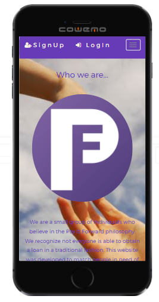
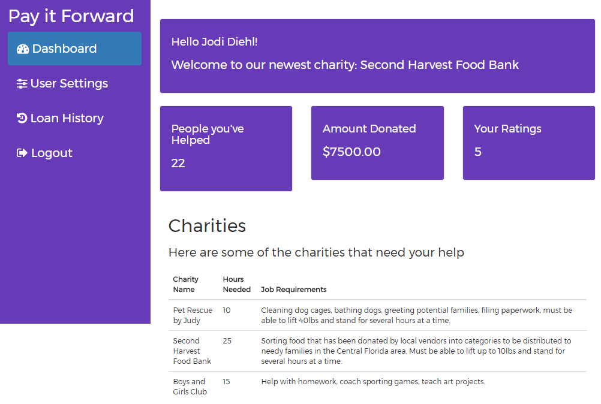
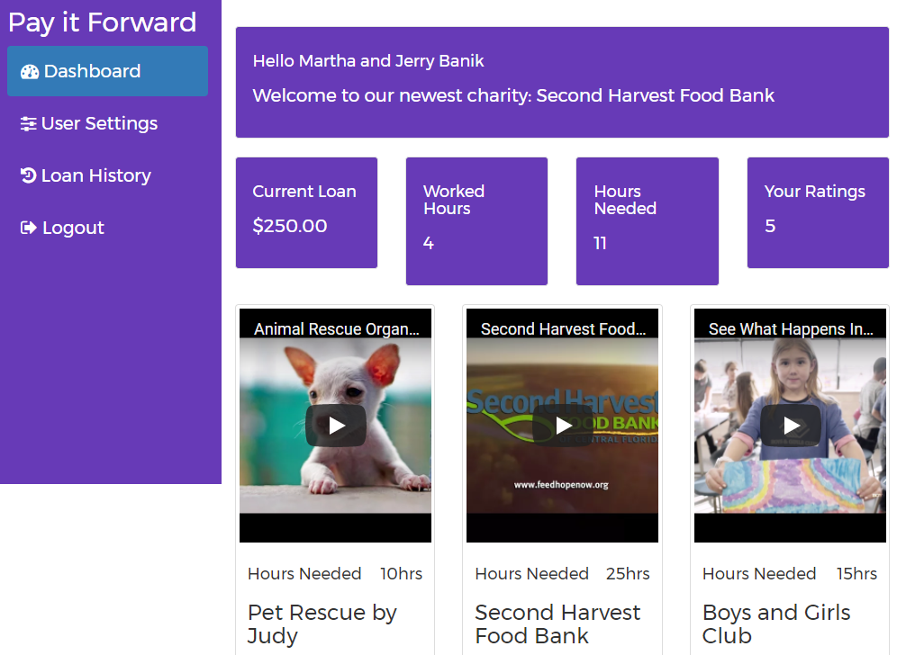

_This app is in continued development.  To stay up to date on our progress, please star this repo or reach out to one of the collaborators directly_

# Pay It Forward

Matching donors with recipients who will in turn volunteer at a charity in exchange for the support. Built using node, express, EJS, Bootstrap, HTML5, mySQL, and deployed at Heroku.  Developed as mobile responsive.

### Donor Dashboard

### User Dashboard

### Collaborators
* Bill Scarpelli - https://github.com/billscarp
* Jason Navarro - https://github.com/Jasonnavarro86
* Jodi Diehl - https://github.com/jdiehl99
* Joey Boone - https://github.com/joeyfboone
* Mario Mazza - https://github.com/mariogmazza
